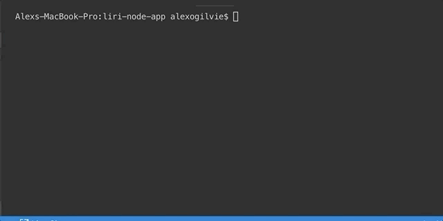

# liri-node-app
This CLI app is used to gather information media information based on user input.

The Liri app takes user input to dictate the terms of the search. Available search options are concerts, movies, and song information. The user will first input what they would like to search for, then the search term. Upon running the app a function that determines what kind of a request to send. The request comes back and logs your results. In the event of no input defaults have been put in place.

How to use:
Step 1 – Type node
Step 2 – Type liri.js (the file name)
Step 3 – Type your inquiry in the form of ‘movie-this’, ‘concert-this’, ‘spotify-this-song’ or ‘do-what-it-says.’
Step 4 – Press enter and let the magic happen

Technology Used:

•JavaScript
 
•Dotenv
 
•Spotify API
 
•Bands in Town API
 
•OMDB API
 
•Axios
 
•Moment
 

<strong>'do-what-it-says' input</strong>
 
<strong></strong>
 
<strong>'concert-this' input
 
<strong></strong>
 
<strong>'movie-this' input
 
<strong></strong>
 
<strong>'spotify-this-song' input
 
<strong></strong>
